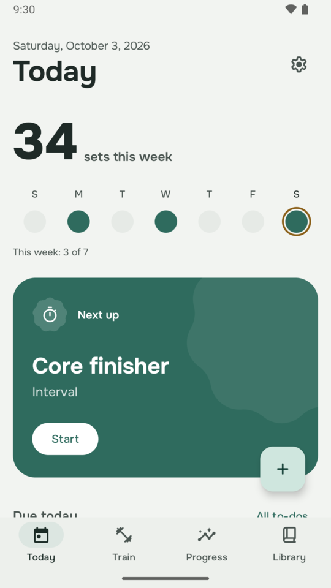
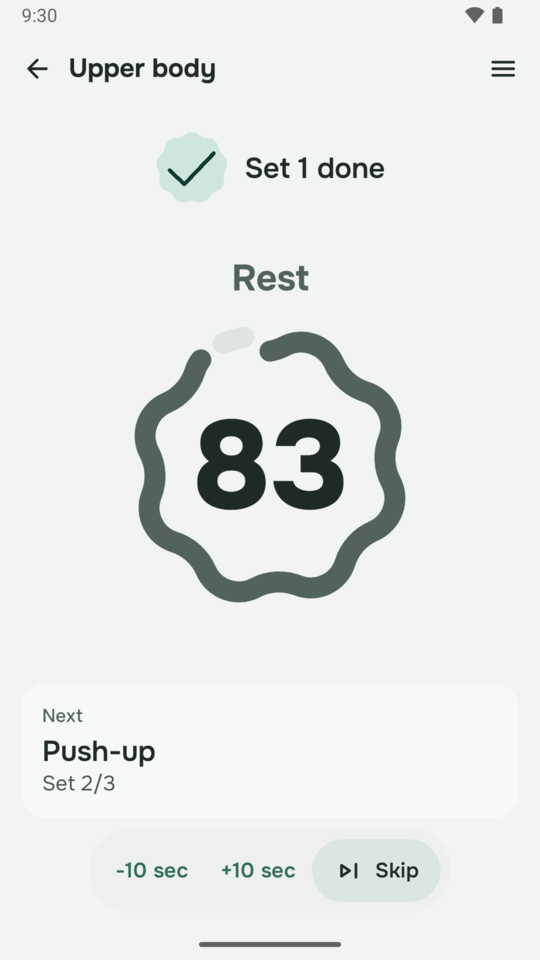
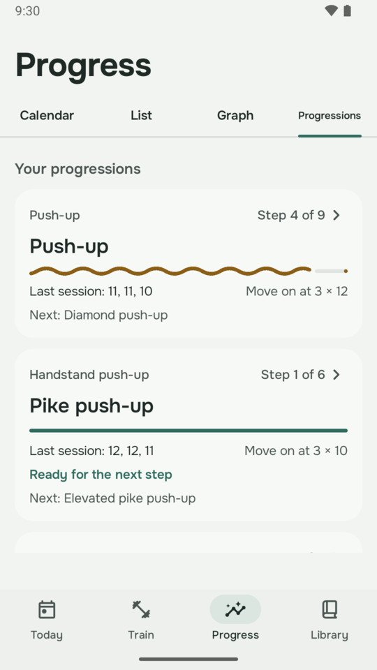
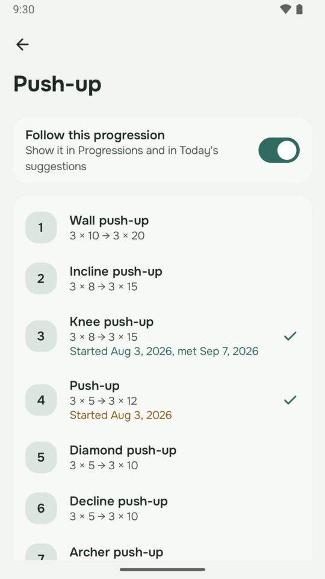
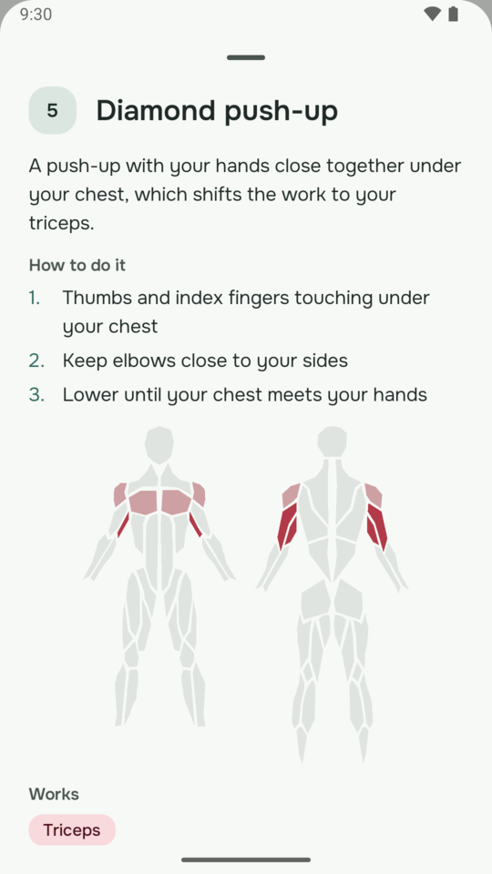
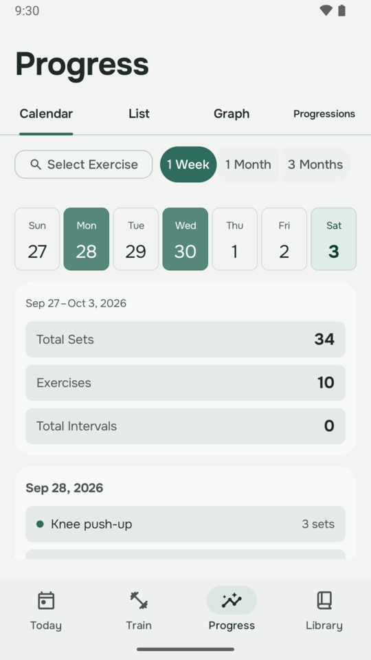

<a id="top"></a>

<p align="center">
  <picture>
    <source media="(prefers-color-scheme: dark)" srcset=".github/readme/banner-dark.svg">
    
  </picture>
</p>

<p align="center">
  
  
  
  
  
</p>

<p align="center">
  <b>Kalimory</b> plans your bodyweight training, runs it with you, and remembers every set.<br>
  It guides you up 29 progression chains, from the wall push-up to the planche, and never locks a thing.
</p>

<p align="center">
  <a href="#features">Features</a> ·
  <a href="#screenshots">Screenshots</a> ·
  <a href="#progressions">Progressions</a> ·
  <a href="#privacy">Privacy</a> ·
  <a href="docs/wiki/Home.md">User guide</a> ·
  <a href="#building">Building</a>
</p>

> [!IMPORTANT]
> **Your training never leaves your phone.** Kalimory has no account, no ads, no analytics and no internet permission at all. Backups are files you keep.

<h2 id="features">Features</h2>

<table>
  <tr>
    <td width="50%" valign="top">&nbsp;<b>Today</b><br>&nbsp;This week at a glance, what is due, and a suggestion for what to train next.</td>
    <td width="50%" valign="top">&nbsp;<b>Guided workouts</b><br>&nbsp;Rep counting, hold and rest timers, programs and intervals. Timers keep going with the screen off.</td>
  </tr>
  <tr>
    <td valign="top">&nbsp;<b>157 steps in 29 chains</b><br>&nbsp;Form cues, a muscle map, the equipment each needs, and clear standards to start and move on.</td>
    <td valign="top">&nbsp;<b>Progressions</b><br>&nbsp;Where you stand in each chain, how close you are to the next step, and when you got there.</td>
  </tr>
  <tr>
    <td valign="top">&nbsp;<b>History that lasts</b><br>&nbsp;A calendar, lists, graphs and personal bests. Log past workouts with several exercises at once.</td>
    <td valign="top">&nbsp;<b>Your data, your files</b><br>&nbsp;Complete JSON backups, CSV import and export, and recovery files if the database is ever damaged.</td>
  </tr>
  <tr>
    <td valign="top">&nbsp;<b>Ten languages</b><br>&nbsp;English, Arabic, Chinese, French, German, Italian, Japanese, Russian, Spanish and Ukrainian.</td>
    <td valign="top">&nbsp;<b>Calm by design</b><br>&nbsp;Light, dark and true-black AMOLED themes, and optional wallpaper colours.</td>
  </tr>
</table>

<h2 id="screenshots">Screenshots</h2>

<table>
  <tr>
    <td width="33%" align="center"><picture><source media="(prefers-color-scheme: dark)" srcset=".github/readme/screens/today-dark.png"></picture><br><sub>Today</sub></td>
    <td width="33%" align="center"><picture><source media="(prefers-color-scheme: dark)" srcset=".github/readme/screens/rest-dark.png"></picture><br><sub>Workout</sub></td>
    <td width="33%" align="center"><picture><source media="(prefers-color-scheme: dark)" srcset=".github/readme/screens/progressions-dark.png"></picture><br><sub>Progressions</sub></td>
  </tr>
  <tr>
    <td width="33%" align="center"><picture><source media="(prefers-color-scheme: dark)" srcset=".github/readme/screens/chain-dark.png"></picture><br><sub>Chain</sub></td>
    <td width="33%" align="center"><picture><source media="(prefers-color-scheme: dark)" srcset=".github/readme/screens/step-dark.png"></picture><br><sub>Step</sub></td>
    <td width="33%" align="center"><picture><source media="(prefers-color-scheme: dark)" srcset=".github/readme/screens/calendar-dark.png"></picture><br><sub>History</sub></td>
  </tr>
</table>

<p align="center"><sub>Shown with made-up training data. Light or dark follows your GitHub theme.</sub></p>

<h2 id="progressions">Progressions</h2>

Every exercise in the catalogue belongs to a chain of steps, each harder than the last. Train a step until a session meets its move-on standard, and Kalimory suggests the next one. Skills such as the muscle-up and the planche show the steps they build on. Every step is open to you from the start.

<p align="center">
  <picture>
    <source media="(prefers-color-scheme: dark)" srcset=".github/readme/chain-dark.svg">
    
  </picture>
</p>

<details>
<summary><b>All 29 chains</b></summary>
<br>

| Fundamentals | Skills | Strength and conditioning | Mobility |
|:---|:---|:---|:---|
| Push-up | Handstand | Calf raise | Lower body mobility |
| Handstand push-up | L-sit | Lunge | Shoulder and wrist mobility |
| Dip | Muscle-up | Explosive | |
| Pull-up | Front lever | Rollout and dragon flag | |
| Row | Back lever | Rotation | |
| Squat | Planche | Side core | |
| Hip hinge | Human flag | Back extension | |
| Core | Rings | Grip | |
| Leg raise | | Back bridge | |
| | | Burpee | |

</details>

<h2 id="privacy">Privacy</h2>

<table>
  <tr>
    <td width="50%" valign="top">&nbsp;<b>No internet permission</b><br>&nbsp;The app cannot send anything anywhere. No account, no ads, no analytics and no crash reporting.</td>
    <td width="50%" valign="top">&nbsp;<b>Only what workouts need</b><br>&nbsp;<code>FOREGROUND_SERVICE</code>, <code>FOREGROUND_SERVICE_SPECIAL_USE</code> and <code>WAKE_LOCK</code> keep timers running with the screen off; <code>FLASHLIGHT</code> can flash at the end of a rest; <code>POST_NOTIFICATIONS</code> shows the running timer, and is asked for only when your first workout opens.</td>
  </tr>
</table>

More in the [Privacy](docs/wiki/Privacy.md) and [Backups](docs/wiki/Backups-and-Your-Data.md) pages of the user guide.

<h2 id="building">Building</h2>

Requires JDK 17 or later and the Android SDK.

```bash
./gradlew assembleDebug
```

The full local check, run before every merge, is in [CONTRIBUTING.md](CONTRIBUTING.md).

## Contributing

Bug reports, catalogue corrections and ideas are welcome through the issue templates. Please read [CONTRIBUTING.md](CONTRIBUTING.md) before opening a pull request.

## Credits

Kalimory began as a fork of [Calisthenics Memory by Gonbei774](https://codeberg.org/Gonbei774/CalisthenicsMemory), whose work and history are kept in this repository. It has since been substantially redesigned and extended. Thanks also to the original project's translators.

The muscle map outlines come from react-body-highlighter (MIT), and the icons are Material Symbols (Apache-2.0). See [Credits and sources](docs/wiki/Credits.md).

## License

GNU General Public License v3.0. See [LICENSE](LICENSE).

<p align="right"><a href="#top">Back to top</a></p>
