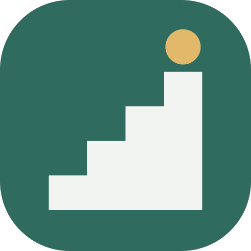

<p align="center">
  
</p>

<h1 align="center">Kalimory</h1>

<p align="center">A calm, offline place to plan, run and remember your bodyweight training.</p>

<p align="center">
  
  
</p>

No account, no internet permission, no ads, no analytics. Your workouts stay on your phone.

## What it does

- **Today.** This week at a glance, what is due, and suggestions for what to train next.
- **Workouts.** Single exercises with rep counting and hold timers, multi-exercise programs you can pause and resume, and interval routines. Timers keep running with the screen off.
- **Log past workouts**, with several exercises in one session.
- **An exercise catalogue** of 101 steps in 19 progression chains, from the wall push-up to the planche. Each step has form cues, a muscle map, the equipment it needs, and a starting and a move-on standard. Skills name the steps they build on. Nothing is locked.
- **Progressions.** For each chain you follow: your current step, how close you are to moving on, and the dates you started and met each step.
- **Progress.** A calendar, lists, graphs, personal bests and a weekly goal.
- **Your data, your files.** Complete JSON backups, CSV import and export, and recovery files if the database is ever damaged.
- **Ten languages:** English, Arabic, Chinese (Simplified), French, German, Italian, Japanese, Russian, Spanish and Ukrainian.
- Light and dark themes, with optional wallpaper colours.

## Documentation

The user guide lives in [`docs/wiki`](docs/wiki/Home.md).

## Permissions

- `FOREGROUND_SERVICE`, `FOREGROUND_SERVICE_SPECIAL_USE`, `WAKE_LOCK`: keep workout timers running in the background.
- `FLASHLIGHT`: an optional flash at the end of a rest.

The app does not request `INTERNET`.

## Building

Requires JDK 17 or later and the Android SDK.

```bash
./gradlew assembleDebug
```

The full local check, run before every merge, is in [CONTRIBUTING.md](CONTRIBUTING.md).

## Contributing

Bug reports, catalogue corrections and ideas are welcome through the issue templates. See [CONTRIBUTING.md](CONTRIBUTING.md) before opening a pull request.

## Credits

Kalimory began as a fork of [Calisthenics Memory by Gonbei774](https://codeberg.org/Gonbei774/CalisthenicsMemory), whose work and history are kept in this repository. It has since been substantially redesigned and extended. Thanks also to the original project's translators.

The muscle map outlines are adapted from react-body-highlighter (MIT). See [Credits and sources](docs/wiki/Credits.md) and the app's Open Source Licenses screen.

## License

GNU General Public License v3.0. See [LICENSE](LICENSE).
